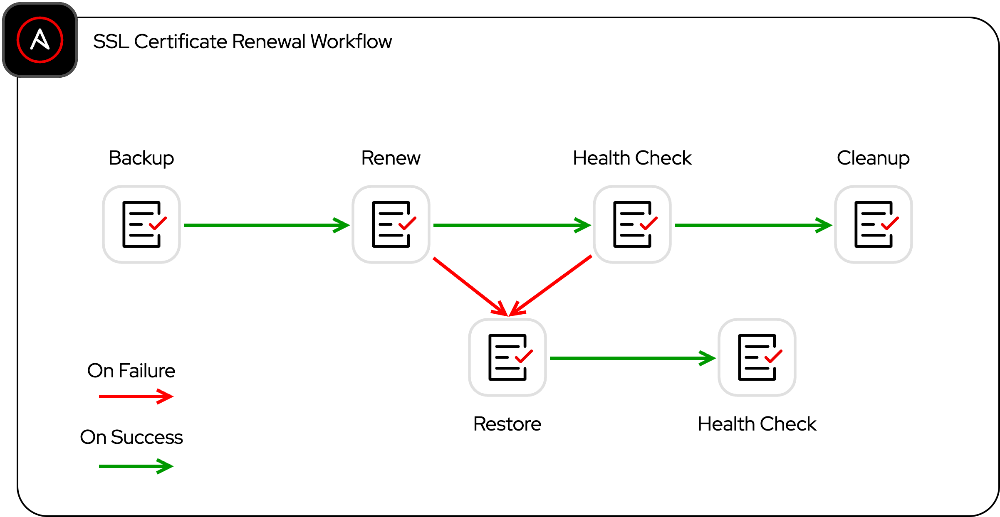

# SSL Certificate Renewal

Ansible Automation Platform Workflow for renewing SSL certificates for one or more sites. The target environment leverages the following technologies:

- Ansible Automation Platform
- Nginx (reverse proxy)
- Debian Host (Raspberry Pi)
- Cloudflare DNS (Domain management)

## The Workflow

The Workflow was designed to represent a generic certificate renewal process using SSL certificates as an example implementation. The high-level steps which could be applied to any scenario consist of:

| Step | Purpose | Playbook |
| --- | --- | --- |
| Backup | Backup existing artifacts as an option for restoration if necessary | [pb_ssl_backup.yml](../pb_ssl_backup.yml) |
| Renew | Renew SSL certificates via integration with Cloudflare for verification of ownership | [pb_ssl_renew.yml](../pb_ssl_renewal.yml) |
| Health Check | Perform a health check to ensure new certificates did not impact services | [pb_ssl_healthcheck.yml](../pb_ssl_healthcheck.yml) |
| Restore | Restore from backups in the case of failure at any step | [pb_ssl_restore.yml](../pb_ssl_restore.yml) |
| Cleanup | Cleanup backups to prevent storage bloat (optional) | [pb_ssl_cleanup.yml](../pb_ssl_cleanup.yml) |

The diagram below outlines how the playbooks are connected to create an end-to-end workflow for SSL certificate renewal with safeguards and rollback mechanisms in place:
